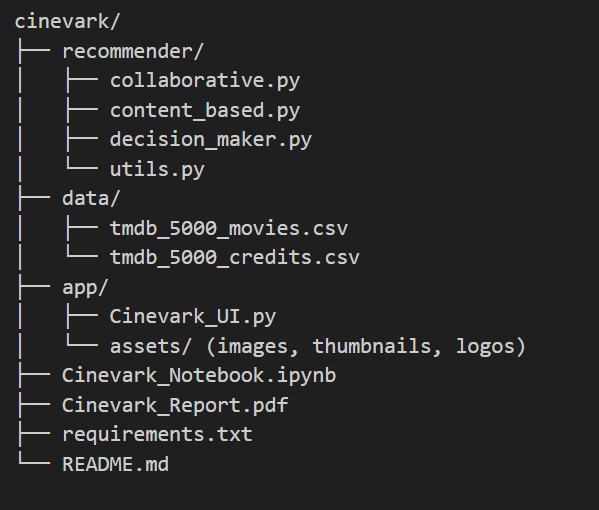
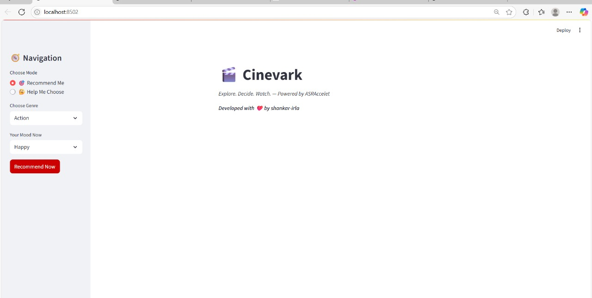
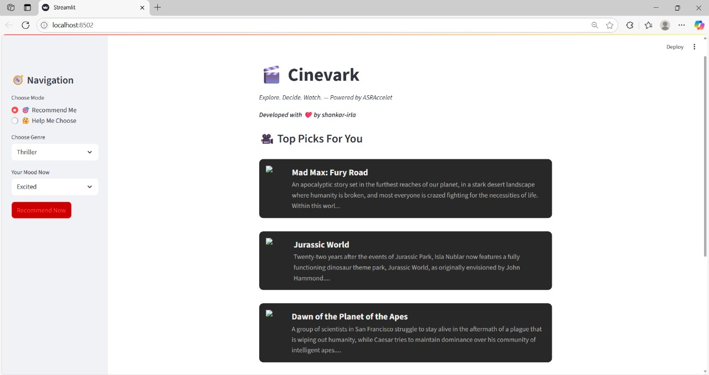
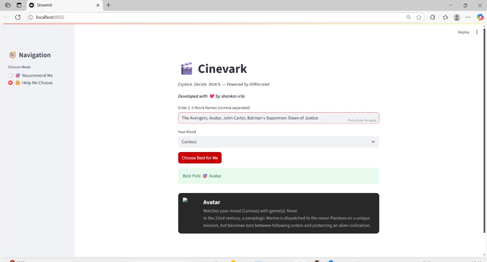
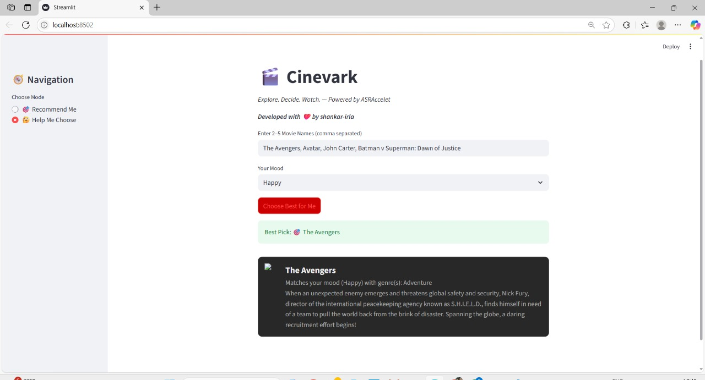

# CINEVARK🎬 – AI-POWERED MOVIE RECOMMENDATION SYSTEM 

Explore. Decide. Watch.  
Developed with ❤️ by Shankar Irla — ASRAccelet Team

Cinevark is an AI-powered movie recommendation web app that helps users discover the right movie to watch based on their mood, preferences, or a shortlist of confusing options. Built with Streamlit and powered by TMDb 5000 dataset, it combines collaborative filtering, content-based logic, and mood-based decision making — all wrapped in a modern, YouTube-like UI.

📸 Thumbnail  

---

## 🚀 Features

- 🎯 Recommend Me: Suggest top movies based on selected genre and user mood.  
- 🤔 Help Me Choose: Confused between 2–5 movies? We’ll ask some questions and recommend the best.  
- 🧠 Uses both Collaborative & Content-Based Filtering  
- 🎨 Dark theme inspired by YouTube for modern appeal  
- 🖼️ Movie posters, descriptions, and mood-based reasoning  
- 📦 Ready-to-run: Streamlit App + Notebook + Modular Code

---

## 🛠️ Tech Stack

- Python 3.10+
- Pandas, Scikit-learn, NumPy
- Streamlit (Frontend UI)
- TMDb 5000 Dataset (Kaggle)
- HTML + CSS for styling UI components

---

## 📁 Project Structure

---

## 🎥 UI & Demo

🧭 Main Interface  
Choose between two modes — Recommend Me or Help Me Choose

🔍 Recommendation Results  
Cards with movie posters, descriptions, and reasons

🧠 Help Me Decide Feature  
Select 2–5 movies, answer mood, get personalized pick!

try run 1:

try run 2:

🎬 Watch Cinevark Demo on YouTube

---

## 📊 Dataset

TMDb 5000 Movies & Credits dataset from Kaggle  
- 5,000+ movies  
- Includes genres, overviews, keywords, popularity, poster paths  
- Cleaned and enriched with full poster URLs for UI

---

## 🧪 How to Run

1. Clone the repo  
   git clone https://github.com/shankar-irla/cinevark.git

2. Install dependencies  
   pip install -r requirements.txt

3. Run the app  
   streamlit run app/Cinevark_UI.py

4. Enjoy Cinevark 🎥

---

## 📘 Report

For a detailed report:  
📄 Cinevark_Report.pdf (in root folder)

Includes:  
✔️ Problem Overview  
✔️ Methodology  
✔️ ML Logic (CBF + CF + Decision Assistant)  
✔️ Tools Used  
✔️ Future Enhancements

---

## 🔮 Future Scope

- Integrate LLMs to handle natural conversation input  
- Add real-time reviews/sentiment analysis  
- Streaming platform filters (Netflix, Prime, etc.)  
- Personalized login & watch history

---

🧑‍💻 Developed with ❤️ by Shankar Irla  
🌐 Powered by ASRAccelet
